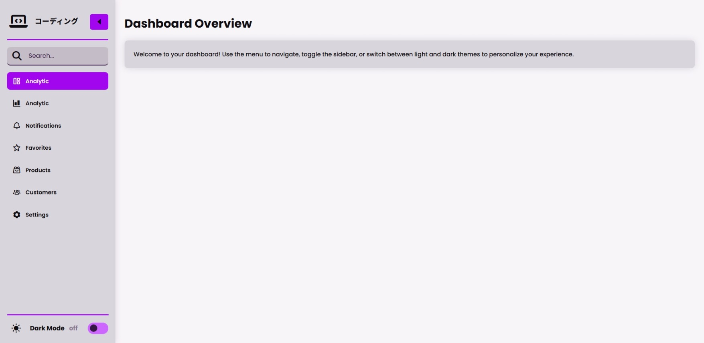
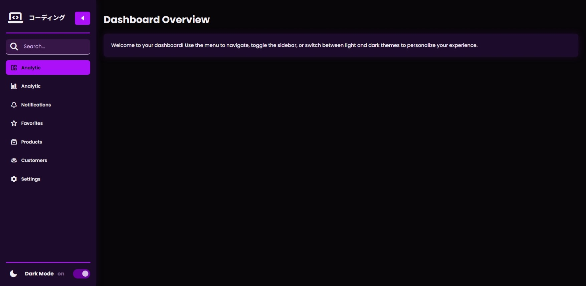
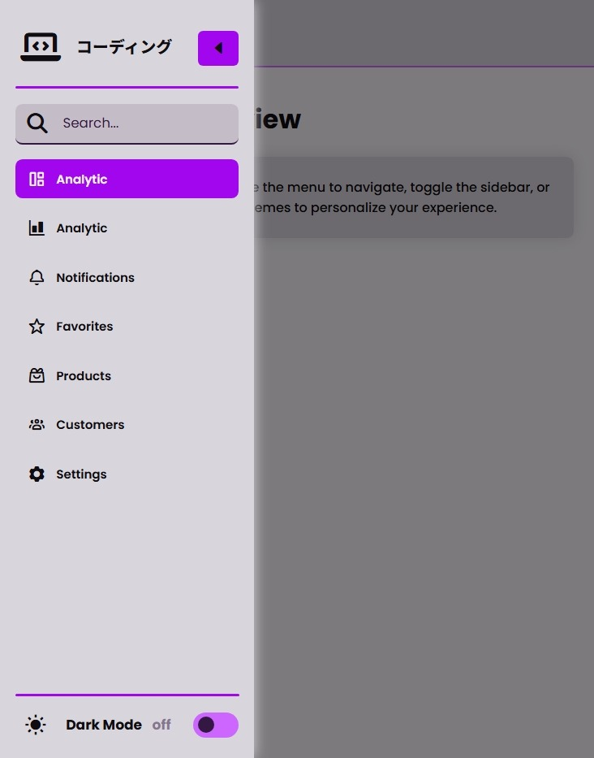
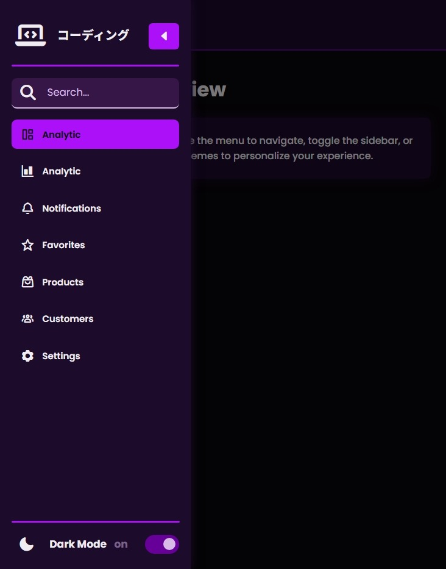

# 🌗 Responsive Sidebar & Theme Switching

> **_“A minimalist sidebar UI for modern dashboards — built from scratch.”_**

A **modern responsive sidebar navigation UI** with **light/dark mode toggle**, smooth transitions, and intuitive interactions.
Built entirely with **HTML, CSS, and Vanilla JavaScript** — no frameworks, only clean design and fluid motion.

🔗 **[Live Demo](https://nsnet21.github.io/07-responsive-sidebar-and-theme-switching/)**

---

## 🖼️ Preview

**Light Theme**



**Dark Theme**



| Mobile Light                                                    | Mobile Dark                                                   |
| --------------------------------------------------------------- | ------------------------------------------------------------- |
|  |  |

---

## 🚀 Features

### 🎨 Responsive & Themed

- Switch between **Light** and **Dark** modes.
- Theme preference is **saved automatically** using `localStorage`.
- Animated icon transitions (`sun ☀️` ⇄ `moon 🌙`).

---

### 🧭 Interactive Sidebar

- **Collapsible sidebar** with smooth width animation.
- **Two toggle buttons** (`main` and `top navbar`).
- Auto-closes on small screens when clicking outside.
- Icons and text fade elegantly between collapsed/expanded states.

---

### 🔍 Search Integration

- Interactive search box inside the sidebar.
- **Auto-focus** when sidebar expands from collapsed state via search icon click.
- Highlighted border when active (using `:focus-within`).

---

### ⚙️ Active Link Highlighting

- Clicked link automatically gains `active` state.
- Automatically removes previous active highlight.

---

---

## 💻 Tech Stack

| Area          | Tech Used                                                                                                              |
| ------------- | ---------------------------------------------------------------------------------------------------------------------- |
| Structure     | HTML5                                                                                                                  |
| Styling       | CSS3 (Variables, Flexbox, Media Queries)                                                                               |
| Interactivity | Vanilla JavaScript                                                                                                     |
| Icon Sets     | [Boxicons](https://boxicons.com/) & [Font Awesome 7](https://fontawesome.com/)                                         |
| Fonts         | [Poppins](https://fonts.google.com/specimen/Poppins), [Noto Serif JP](https://fonts.google.com/specimen/Noto+Serif+JP) |

---

## 🧩 How It Works

- **Theme System**
  Uses `data-theme` on `<html>` for global CSS variable swapping:
  ```css
  :root[data-theme="light"] {
    --background: #f8f5f9;
    --text: #100d12;
  }
  :root[data-theme="dark"] {
    --background: #09060a;
    --text: #f0edf2;
  }
  ```
- Theme Persistence

  Stored in browser’s localStorage:

  ```js
  const savedTheme = localStorage.getItem("theme");
  if (savedTheme)
    document.documentElement.setAttribute("data-theme", savedTheme);
  ```

- Sidebar Collapse Animation

  ```js
  sideBar.classList.toggle("collapsed");
  toggleMenu.style.transform = "rotate(-180deg)";
  ```

- Auto-close on Small Screens

  ```js
  document.addEventListener("click", (e) => {
    if (
      window.matchMedia("(max-width: 768px)").matches &&
      !sideBar.contains(e.target)
    ) {
      sideBar.classList.add("collapsed");
    }
  });
  ```

## 🧱 Folder Structure

```
  07Responsive-Sidebar-and-Theme-Switching/
  │
  ├── assets-preview/
  │   ├── dark-theme-preview.jpeg
  │   ├── light-theme-preview.jpeg
  │   ├── mobile-dark-theme-preview.jpeg
  │   └── mobile-light-theme-preview.jpeg
  │
  ├── images/
  │
  ├── index.html
  ├── style.css
  ├── script.js
  ├── README.md
  └── .gitignore
```

## 📖 Learning Focus

> 🧩 Each feature in this project was crafted to balance **clarity, motion, and function** — a small but solid step in mastering modern UI design.

- Practice **theme toggling logic** with `localStorage`
- Build **collapsible sidebar** using only CSS + JS
- Handle **responsive behavior** with media queries
- Add **click-outside detection** for mobile sidebar
- Create **smooth icon transitions** with `transform` and `transition`

---

Designed & coded by [**Nate**](https://github.com/NSNet21)
💡 "_Learning to blend design and logic — one sidebar at a time._"
